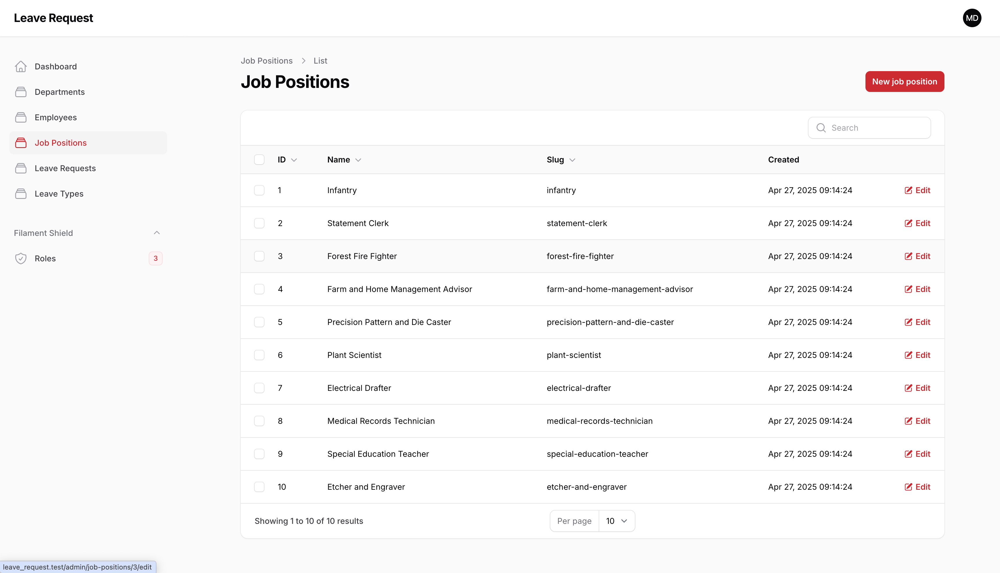
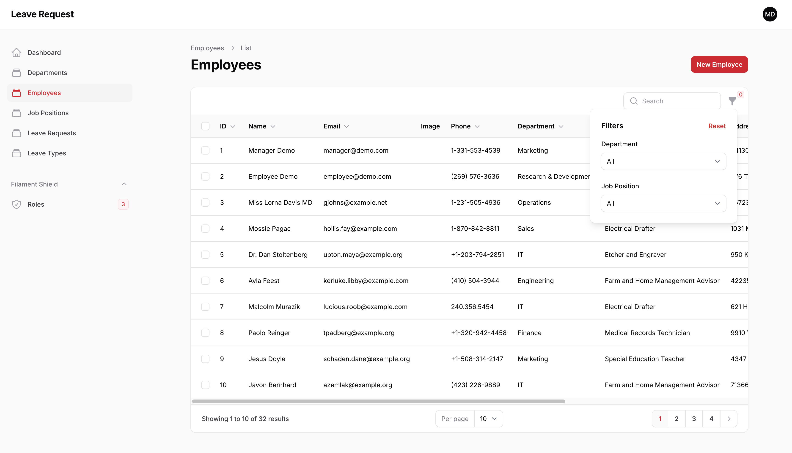

# Project Overview

### Department Interface

Quickly add new departments by name (slug is auto-generated), view them in a sortable, searchable list showing ID, name, slug, and creation date, and use edit or bulk delete actions.

### Job Position Interface

Quickly add new job positions by name (slug is auto-generated), view them in a sortable, searchable list showing ID, name, slug, and creation date, and use edit or bulk delete actions.

### Employee Interface

Effortlessly add and update employees—name, email, contact details, department, position, and profile image—and filter by department or position, edit, or delete directly from the table.

