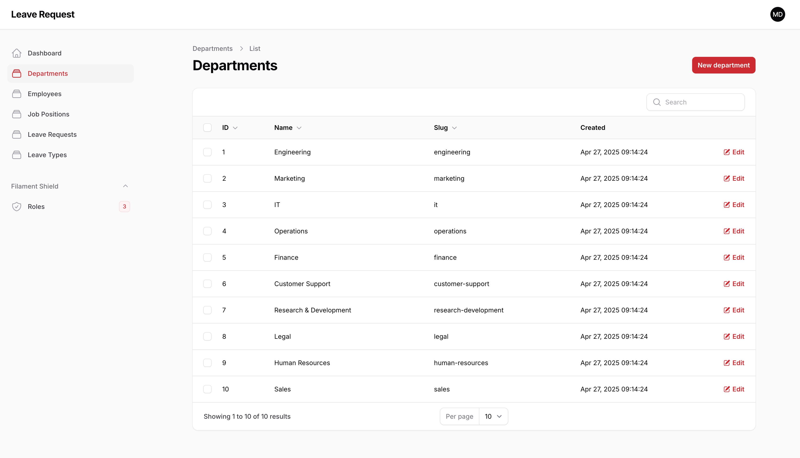

# Installation:
#### Add Env file
```cp .env.example .env```
#### Install composer:
```composer install```
#### Generate Key:
```php artisan key:generate```
#### Migrate Database:
```php artisan migrate```
#### Seed Database:
```php artisan db:seed```
### Run the Application:
```php artisan serve```

## Instructions:
After seeding the database, you can access the application at the url shown in the command line, and you will have the following accounts:
> Manager Account (with super admin role that has all permissions): <br/>
> Email: manager@demo.com <br/>
> Password: password
> 
> Employee Account (with employee role that can add leave type requests): <br/>
> Email: employee@demo.com <br/>
> Password: password

# Project Overview
### Dashboard Interface:

The dashboard shows three core leave-request metrics—pending, approved, and rejected counts—followed by a quick summary of totals for departments, users, job positions, roles, and leave types.

### Department Interface

Add new departments by name (slug is auto-generated), view them in a sortable, searchable list showing ID, name, slug, and creation date, and use edit or bulk delete actions.

### Job Position Interface

Add new job positions by name (slug is auto-generated), view them in a sortable, searchable list showing ID, name, slug, and creation date, and use edit or bulk delete actions.

### Leave Type Interface

Define different leave categories (like vacation, sick, or bereavement), see them in a searchable table, and create, edit, or remove types individually or in bulk.

### Employee Interface

Add and update employees—name, email, contact details, department, position, and profile image—and filter by department or job position, edit, or delete directly from the table.

### Leave Request Interface
#### List View

#### Form View

The leave-request interface guides users through selecting who the request is for (with a searchable dropdown for super-admins and automatic assignment for everyone else), picking a leave type, choosing valid start/end dates (past dates are disabled and the end date can’t precede the start), and adding an optional description—all in a clean, two-column layout. Once submitted, each request appears in the table with badges for its status and filters to narrow by type or status; non-admin users only see their own records, while super-admins can view and manage everyone’s. In the detail view, “Accept” and “Reject” buttons let you update status instantly, with the form refreshing to show the change immediately.

## Roles / Permissions Interface
#### List View

#### Form View

In Roles & Permissions screen, you get can control what each user can see and do.
Just head to “Roles” in the sidebar, pick a role (like Super Admin or Employee), and you’ll find every section of your admin laid out in expandable panels—Departments, Employees, Widgets, and more. Flip the “Select All” switch to grant blanket access, or tick individual checkboxes (View, Create, Update, Delete) to give permissions to the smallest action. You can search, edit, or remove roles anytime, and every change takes effect instantly—no coding required. It’s a friendly, human-centered approach to making sure everyone on your team has just the right level of access.
